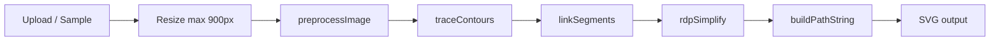

# img2svg — Tài liệu kỹ thuật

## Tổng quan

**Vectra B&W SVG** là ứng dụng client-side chuyển ảnh raster (PNG, JPG, WebP) thành file SVG một màu. Toàn bộ xử lý chạy trong trình duyệt qua Canvas API — không gọi server, không dùng AI/API bên ngoài.

### Luồng xử lý chính



Pipeline được kích hoạt reactive qua `useEffect` trong `App.tsx`, debounce 80ms khi người dùng thay đổi slider hoặc preset.

---

## Cấu trúc thư mục

```
img2svg/
├── index.html              # Entry HTML
├── package.json
├── vite.config.ts          # Vite + React + Tailwind
├── tsconfig.json
├── metadata.json           # Metadata app (nếu deploy AI Studio)
├── src/
│   ├── main.tsx            # React bootstrap
│   ├── App.tsx             # UI chính, state, pipeline orchestration
│   ├── index.css           # Tailwind + custom scrollbar/range
│   ├── samples/
│   │   └── drawSamples.ts  # 3 ảnh mẫu vẽ bằng Canvas (offline)
│   └── utils/
│       └── vectorizer.ts   # Core algorithms
└── docs/
    └── ARCHITECTURE.md     # File này
```

---

## Module `vectorizer.ts`

### Types

| Type | Mô tả |
|------|--------|
| `Point` | `{ x, y }` — tọa độ sub-pixel |
| `Segment` | `[Point, Point]` — đoạn biên từ Marching Squares |

### `preprocessImage(imageData, brightness, contrast)`

- Input: `ImageData` từ canvas, brightness/contrast ∈ [-100, 100]
- Chuyển RGB → grayscale (ITU-R BT.601: `0.299R + 0.587G + 0.114B`)
- Áp brightness offset và contrast factor
- Output: `Uint8Array` grayscale + kích thước

### `traceContours(grayscale, width, height, threshold, invert)`

Thuật toán **Marching Squares** trên lưới 2×2:

1. Mỗi ô có 4 góc so với `threshold` → state 0–15
2. **Linear interpolation** trên cạnh ô để điểm giao không bám pixel grid
3. Xử lý saddle cases (state 5, 10) bằng 2 đoạn chéo
4. `invert: true` đảo logic đen/trắng

### `linkSegments(segments)`

Ghép các `Segment` rời rạc thành polyline/loop:

- Spatial hash map: key = `"x.xxxx,y.yyyy"` (4 chữ số thập phân)
- Duyệt từng segment chưa visit, nối tiếp qua adjacency
- Output: `Point[][]` — mỗi phần tử là một đường liên tục

### `rdpSimplify(points, epsilon)`

**Ramer–Douglas–Peucker** đệ quy:

- Giữ điểm xa nhất so với đoạn đầu–cuối > ε
- ε = 0 → giữ nguyên; ε lớn → ít điểm, đường mượt hơn

### `buildPathString(points, useBezier)`

Tạo SVG `d` attribute:

- **Polygon mode** (`useBezier: false`): `M` + `L` + `Z` nếu đầu/cuối gần nhau (< 2px)
- **Bezier mode** (`useBezier: true`): quadratic Bézier qua midpoint giữa các đỉnh

---

## Module `App.tsx`

### State chính

| Nhóm | Biến | Mặc định |
|------|------|----------|
| Ảnh | `originalImageData`, `imageWidth/Height`, `imageSrc` | Sample Mandala |
| Tiền xử lý | `brightness`, `contrast`, `threshold` | 0, 20, 128 |
| Vector | `rdpEpsilon`, `useBezier`, `invertColors`, `isFillMode`, `strokeWidth`, `noiseFilter` | 1.0, true, false, true, 2, 4 |
| Màu | `vectorColor`, `backgroundColor`, `useTransparentBg` | #1a1a1a, #fff, true |
| UI | `viewMode`, `zoom`, `showAnchors`, `activePreset` | sideBySide, 100%, false, logo |

### Preset

| ID | Mục đích | Đặc điểm |
|----|----------|----------|
| `logo` | Logo, đồ họa tô đặc | contrast cao, fill mode, ε=1.0 |
| `sketch` | Phác thảo bút chì | stroke mode, ε nhỏ hơn |
| `technical` | Bản vẽ kỹ thuật | không Bézier, ε=0.3 |
| `artistic` | Nét dày đậm | ε=1.8, noise filter cao |

### Chế độ xem

- **sideBySide**: ảnh gốc | SVG kết quả
- **vectorOnly**: chỉ vector, phóng to không vỡ nét
- **thresholdOnly**: canvas nhị phân 1-bit (debug threshold)

### Export

- **SVG**: blob download từ `svgContent`
- **PNG 2x**: render SVG → Image → canvas scale 2.0
- **Copy**: clipboard API

---

## Module `drawSamples.ts`

Ba mẫu vẽ procedural trên canvas 600×600 (không cần fetch ảnh):

1. Mandala — đối xứng 12 cánh
2. Mèo vẽ tay — nét sketch
3. Xoắn ốc + khung vuông xoay

`renderSampleToDataUrl(id)` trả về data URL để nạp vào pipeline.

---

## Dependencies

### Runtime (`dependencies`)

| Package | Vai trò |
|---------|---------|
| `react`, `react-dom` | UI framework |
| `lucide-react` | Icon |
| `motion` | `AnimatePresence` chuyển tab preview |

### Dev (`devDependencies`)

| Package | Vai trò |
|---------|---------|
| `vite` | Bundler + dev server |
| `@vitejs/plugin-react` | JSX/HMR |
| `tailwindcss`, `@tailwindcss/vite` | Styling |
| `typescript`, `@types/node` | Type check |

### Đã loại bỏ (không dùng trong code)

- `@google/genai`, `dotenv`, `express` — boilerplate AI Studio cũ
- `autoprefixer`, `esbuild`, `tsx` — không được gọi trực tiếp
- `@types/express` — theo express

---

## Giới hạn & lưu ý

1. **Kích thước ảnh**: tự resize max 900px cạnh dài để giữ realtime
2. **Một màu**: chỉ hỗ trợ B&W sau threshold, không trace màu
3. **Fill vs stroke**: fill gộp tất cả path vào một `<path>` với `fill-rule="evenodd"`; stroke tách từng loop
4. **Saddle ambiguity**: Marching Squares case 5/10 dùng heuristic cố định, có thể sai ở pattern checkerboard phức tạp
5. **Không persistence**: refresh mất state; không lưu localStorage

---

## Mở rộng gợi ý

- Tách `App.tsx` thành components (`Sidebar`, `Preview`, `StatsBar`)
- Web Worker cho `traceContours` + `linkSegments` trên ảnh lớn
- Hỗ trợ multi-color qua color quantization + trace từng layer
- Unit test cho `vectorizer.ts` (pure functions, dễ test)
